## BioModels documentation

Documentation for the BioModels Linked Dataset

BioModels linked data set contains all curated and non curated SBML models in the BioModels repository in RDF. Each SBML element is captured as a RDF class. The parent-child relationships between the elements and the attributes are captured using RDF properties. An additional property is introduced to capture the curated and non-curated status of each model. The diagrams below show a detailed representation of the schema.

Namespace prefixes:
   - sbmlRdf - http://identifiers.org/biomodels.vocabulary
   - bqbiol - http://biomodels.net/biology-qualifiers
   - bqmodel - http://biomodels.net/model-qualifiers

### Top level class structure
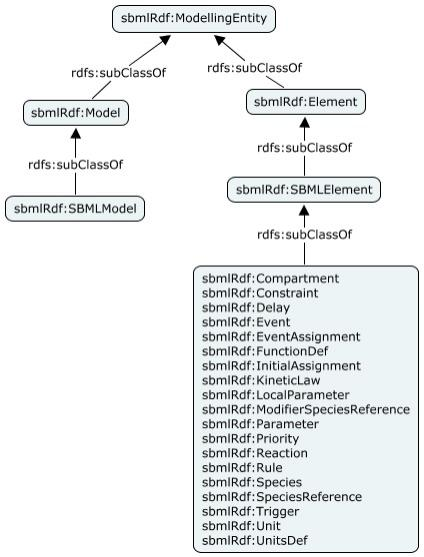

### Top level property structure
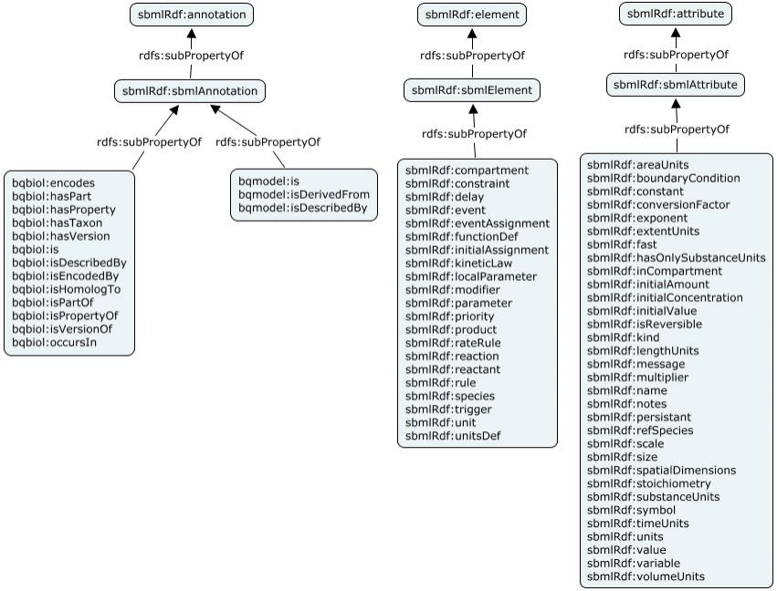

### Common properties
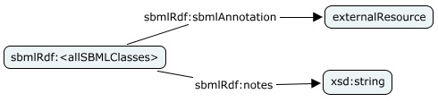

### SBMLModel
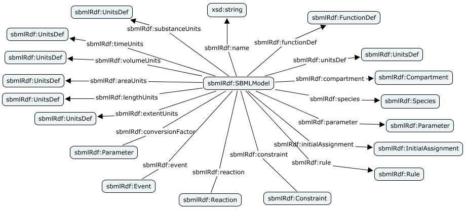

### FunctionDef
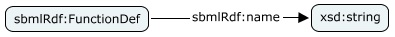

### UnitsDef
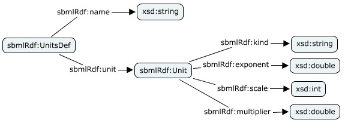

### Compartment
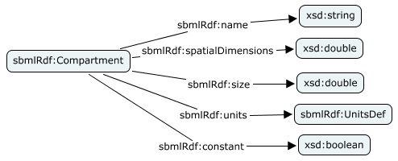

### Species
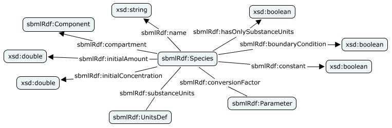

### Parameter
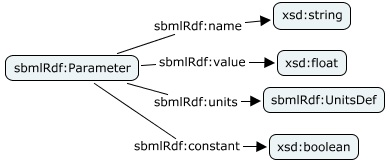

### Initial Assignment

### Rule
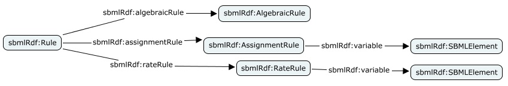

### Constraint
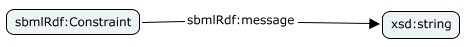

### Reaction
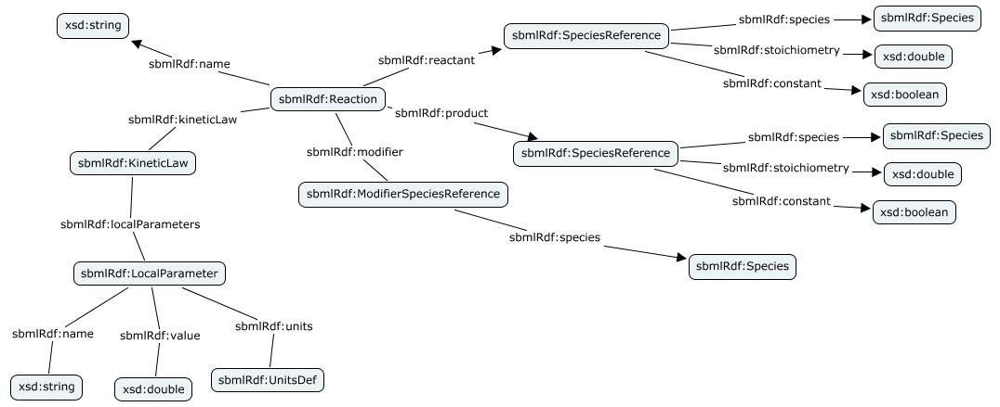

### Event

