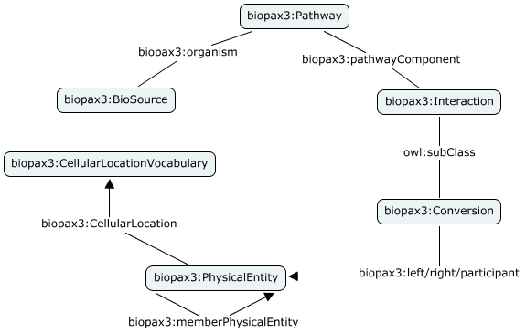

## Reactome documentation

Documentation for the Reactome Linked Dataset.

Reactome Linked Dataset is a modified version of the Reactome/BioPAX available via the Reactome page. The modifications are detailed in the Reactome current status page.

BioPAX specification details the underlying schema. The diagram below shows a very simple schematic to get you started with your queries.

